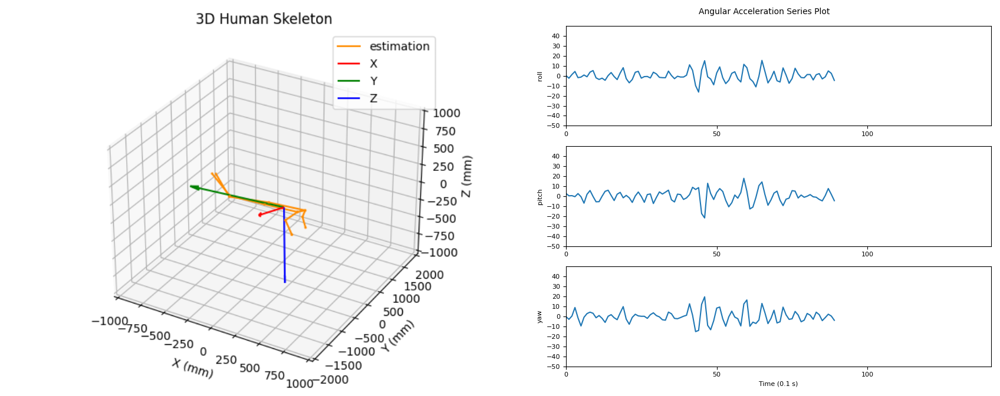
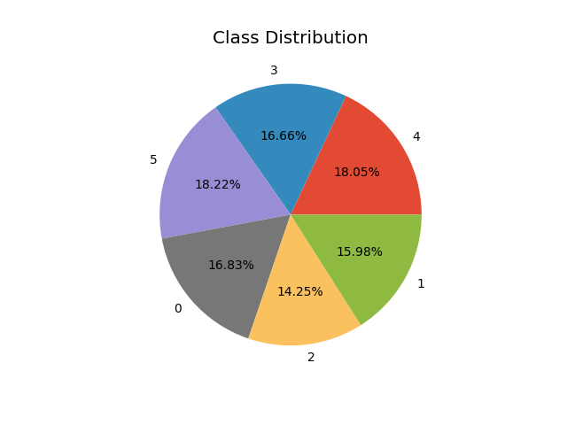
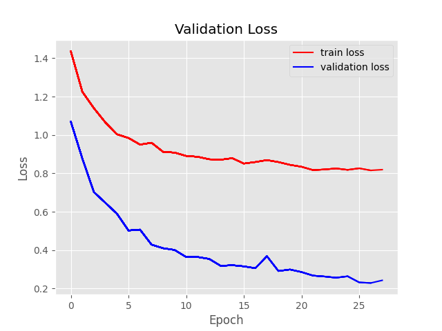
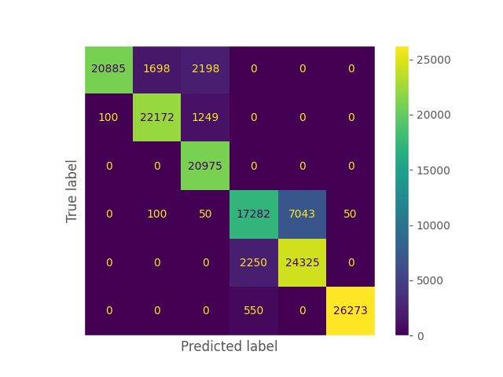

# Anomaly Detection

## Environment Setup

1. Build Docker Image
    ```
    docker build -t anomaly_detection docker/
    ```
    **All codes within this repository should be able to run under this docker environment.**

2. Run Docker container:
    * Change the ```$WORKSPACE_DIR``` variables in [run_container.sh](run_container.sh) to the path where you store this repository before running the following command.
    ```
    bash run_container.sh
    ```
    **```-v $WORKSPACE_DIR:/workspace``` in docker links the path from your local machine to the docker container. All the changes you have made inside the docker container will also take effect on your local machine. That is to say, folders that are not linked with ```-v``` will remain unchanged after you exit the container.** 

## Generates Train/Test Data


### Getting Started

We are going to train time series models on data we collect from the pool trial.

**Choose either one to download train/test data**:
1. Download from [google drive](https://drive.google.com/drive/folders/14vsou90r4-6kk1OC3b_7PR_RuIsdkUwX?usp=drive_link).
2. Download from synology: /volume1/IRVLab_Home_Drive/Project_Diver_Anomaly/data

Then, moves the train and test folder into the [data](data/) folder like follows:
```
anomaly_detection/
└── data/
    └── image_data/
        ├── train/
            ├── moving
            └── notmoving
        └── test/
            ├── moving
            └── notmoving
```

To generate pose features for time series models and image features for vision models, we require three pretrained DL models: [YOLOv8](https://github.com/ultralytics/ultralytics), [VideoPose3d](https://github.com/facebookresearch/VideoPose3D), and [DINOv2](https://github.com/facebookresearch/dinov2).

**Choose either one to download weights**:
1. Download from [google drive](https://drive.google.com/drive/folders/1eugchIQNJ4Tg5Yp_P5i_bo1Uq1k4WJlK?usp=drive_link).
2. Download from synology: /volume1/IRVLab_Home_Drive/Project_Diver_Anomaly/Ying-Kun_Pose_Feature_Extraction/weights

We don't need to download the DINOv2 pretrained weight as it will be automatically downloaded when running the code. Then, moves all weight into the [weight](weight/) folder.

### Run gen_data.py

gen_data.py will take images collected from the pool trail and output the pose and image features for downstream tasks.

Run the following script:
```
python gen_data.py \
    --estimator-model-path ${YOLOv8_MODEL_WEIGHT}
    --liftor-model-path ${VIDEOPOSE_MODEL_WEIGHT} \
    --calib-path ${PATH_TO_CALIB_FILE} \
    --data-path ${PATH_TO_IMAGES_DATA} \
    --dst-path ${OUTPUT_FOLDER}
```

After running the code, you should see the output structured as follows:
```
output/
├── train/
    ├── moving
        ├── zed_2024-07-11-14-51-11
            ├── features (where .npy files are stored)
            ├── pose (where .json files are stored)
            └── vis (visualizations result for debugging)
        ├── ...
    └── notmoving
        ├── ...
└── test/
    ├── moving
        ├── ...
    └── notmoving
        ├── ...
```

### Visualize Time Series Data

To validate training and testing data are correct for the development of time series model, we can visualize those data with ```visualize_pose.py```

Run the following script:
```
python visualize_pose.py \
    --data-path ${PATH_TO_FEATURES_DATA} \
    --dst-path ${OUTPUT_FOLDER} \
    --subject ${SUBJECTS_TO_VISUALIZE}
```

* The ${PATH_TO_FEATURES_DATA} should be either the path to the train data or test data.

* The ${SUBJECTS_TO_VISUALIZE} variable means which subject you are looking for visualization. It is structured as {moving or notmoving}_{data folder name}. ex: moving_zed_2024-07-11-14-51-11

Results from the visualization will be like:


## Time Series Classification Model

| Model Name  | Model Class | Model Overview | Refrence |
| ------------- | ------------- | ------------- | ------------- |
| cnn  | Deep Learning | 2x 1D Convultional Blocks | Zheng, Y., Liu, Q., Chen, E., Ge, Y., Zhao, J.L. (2014). Time Series Classification Using Multi-Channels Deep Convolutional Neural Networks. In: Li, F., Li, G., Hwang, Sw., Yao, B., Zhang, Z. (eds) Web-Age Information Management. WAIM 2014. Lecture Notes in Computer Science, vol 8485. Springer, Cham. https://doi.org/10.1007/978-3-319-08010-9_33  |
| cnn_dw | Deep Learning | Concatenated output of convultional and lstm block is fed to a multi-layer perceptron | Fazle Karim, Somshubra Majumdar, Houshang Darabi, Samuel Harford, Multivariate LSTM-FCNs for time series classification, Neural Networks, Volume 116, 2019, Pages 237-245, ISSN 0893-6080, https://doi.org/10.1016/j.neunet.2019.04.014  |
| cnn_lw | Deep Learning | output of convolutional block is fed to lstm block | R. Mutegeki and D. S. Han, "A CNN-LSTM Approach to Human Activity Recognition," 2020 International Conference on Artificial Intelligence in Information and Communication (ICAIIC), Fukuoka, Japan, 2020, pp. 362-366, doi: 10.1109/ICAIIC48513.2020.9065078.  |
| cnn_cw | Deep Learning | employ depth-wise convolutional block for each feature dimension of time series data | Yi Zheng, Qi Liu, Enhong Chen, Yong Ge, and J. Leon Zhao. (2014). Time Series Classification Using Multi-Channels Deep Convolutional Neural Networks. In Proceedings of the International Conference on Web-Age Information Management (WAIM), pp. 298-310.  |
| attention | Deep Learning | output of multi-headed self-attention encoder block is fed to mutli layer perceptron| George Zerveas, Srideepika Jayaraman, Dhaval Patel, Anuradha Bhamidipaty, and Carsten Eickhoff. 2021. A Transformer-based Framework for Multivariate Time Series Representation Learning. In Proceedings of the 27th ACM SIGKDD Conference on Knowledge Discovery & Data Mining (KDD '21). Association for Computing Machinery, New York, NY, USA, 2114–2124. https://doi.org/10.1145/3447548.3467401  |
| tsf | Traditional Machine Learning | ensemble of descision trees | Deng, Houtao, George Runger, Eugene Tuv, and Martyanov Vladimir. "A time series forest for classification and feature extraction." Information Sciences 239 (2013): 142-153.  |


### How to Train

In this repository, we use the [hydra](https://github.com/facebookresearch/hydra) library to save different configuration settings for different models, datasets, and methods. We have provided the [train_models.sh](train_models.sh) script for you to start training easily.

To train with different models, datasets, batch_size, num_epochs, ..., change the following variables:
```
python runner.py --config-name train_dl model=${MODEL_NAME} dataset=${DATASET_NAME} hyp.batch_size=${BATCH_SIZE} hyp.num_epochs=${NUM_EPOCHS}
```

**More Settings**:
* **task** – default is "classification." For attention-based model, setting task to "imputation" will generate a state dictionary through unsupervised pretraining and use to initalize the weights to perform classification using the attention model.
* **log** - enable the creation of a log file that notes hyperparamters, dataset, loss, and final accuracy for each model.  
* **plots** – enable visualization.
* **device** – specificy identify of gpu (if available) and number of workers for multiprocessing (if set to 0, multiprocessing is disabled). 
* **model hyperparameter**s (such as number of filters, hidden layer nodes, etc.) can be set in the conf/ directory.

**Diver Anomaly Detection**
In this task, we employed two methods to train the time series classification model: pose feature-based and image feature-based approaches.
* **Pose feature-based** training requires a 2D human pose estimation model and a 2D-to-3D lifting model to obtain 3D human poses (up to scale) from input images. We then compute the body’s rotational acceleration and the joints’ translational acceleration values from a sequence of poses. These values are used as features for the time series data.
    ```
    python runner.py --config-name train_pose model=cnn
    ```
* **Image feature-based** training requires an image feature extractor, such as DINOv2 or ResNet, to extract meaningful image features. These features are then fed into a CNN-based time series classification model.
    ```
    python runner.py --config-name train_vis model.backbone=dinov2_vits14
    ```
**Note that in the implementation of training with our custom data, there is a ```undersample: False``` configuration inside [conf/dataset/PoolData.yaml](conf/dataset/PoolData.yaml) that can be set to True to enable undersampling for data balancing.**

### Visualization

If plotting is enabled, the following visualizations will be generated. 

1 – Distribution of classes within the dataset, to facilitate spot-checks for unbalanced data. </br>


2 – Loss graph over the course of training. Loss is calculated from the validation set.  </br>


3 – Confusion matrix calculated based on the test data.  </br>



Dataset and model visualizations will be saved in the following file structure.  

```
plots/
    ├── <dataset_name>/
        ├── confusion_matrix/
            ├── <model_name>/
                ├── <task>/
                    └── cm.png (confusion matrix)
            ├── ...
        ├── dataset_summary/
            ├── <model_name>/
                ├── train_dataloader.png (per batch class distribution – to check for unbalanced datasets)
                └── train_dataloader.png 
            ├── ...
            ├── test_data_classprop.png (proportion of each class in the dataset – to check for unbalanced datasets)
            ├── test_data_classstats.png 
            ├── train_data_classprop.png 
            └── train_data_classprop.png 
        ├── loss_train_valid/
            ├── <model_name>/
                ├── <task>/
                    └── loss_graph.png 
    ├── ...
    
```