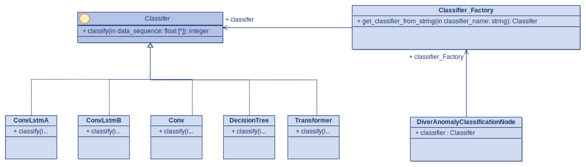

# Diver Anomaly Detection ROS Wrapper 
This whole directory is a catkin_ws

## Introduction
Diver Anomaly Detection (DAD) is a project dedicated
to determining when a diver stops swimming due to a cardiac
anomaly or some other anomalous health event. Robotic dive 
companions can use this code for monitoring their human dive
companion to see if the diver is behaving as expected.

What makes this unique, however, is that we utilize
human pose keypoints as pseudo accelerometers for training
deep neural networks to recognize changes in acceleration
values. 

We distinguish between two states: swimming and not swimming.
This ROS code utilizes detection methodologies to classify
when a diver stops swimming. 

## Installation
You must have ROS noetic running either in a docker container
or in a host environment. 

```
source /opt/ros/noetic/setup.bash
cd /path/to/this/repo
catkin_make
source devel/setup.bash
```

## Description of structure
Inside *src/diver_anomaly* you will find the following directories:
- *config* - > Contains all configuration files for the nodes in (*.YAML) file format
- *models* -> Weight files for all of the models (*.pth) format
- *src* -> Includes all of the source files for the ROS environment. You also have to put
model specification files (*.py) that define your PyTorch models here.

## Creating `Classifier` methods
The structure of the ROS environment relies on a FactoryPattern for reducing the need for
many different classifier ROS nodes. Instead, the way it works is shown below in the UML 
figure.


One ROS node called *DiverAnomalyClassificationNode* utilizes a factory method to create a concrete instance from one of the classes: ConvLstmA, ConvLstmB, Conv, DecisionTree, and Transformer. 

## Testing working functionality
Once you have sourced the catkin_ws environment *source devel/setup.bash*, you can test 
the functionality by having Terminal 1 inside the docker container run the following

```
python3 /path/to/diver_anomaly_ros/src/diver_anomaly/src/test_publisher_sequence_data.py
```

Then in Terminal 2 inside the docker container, run

```
rosrun diver_anomaly classifier_node
```


